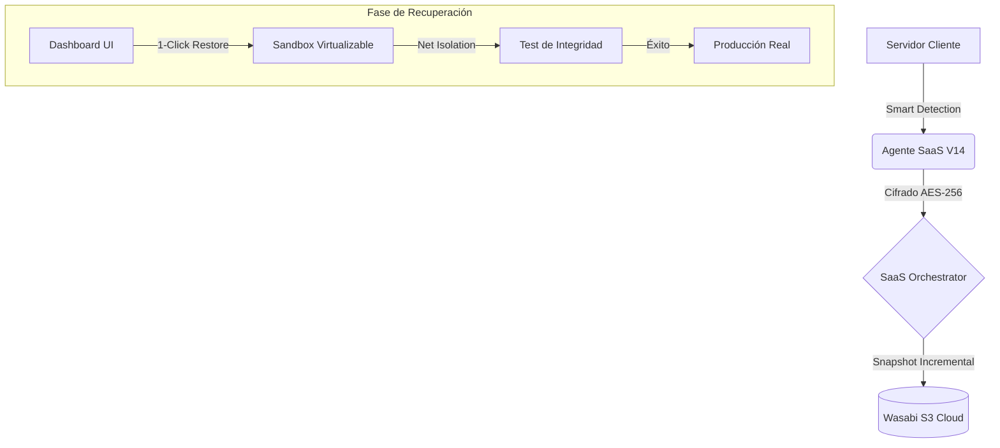

# 🚀 HW Cloud Recovery: Smart SaaS Recovery Experience (V14.2.5)

**Destinatario:** Senior Management / DevOps Operations / CTO / Inversores  
**Versión Actual:** V14.2.5 (Smart & Secure Architecture)  
**Visión:** Transformar la continuidad de negocio en una experiencia transparente, donde la detección de aplicaciones y la recuperación en un clic eliminan la complejidad técnica para el usuario final.

---

## 1. Resumen Ejecutivo (The Peace of Mind Engine)

**HW Cloud Recovery V14.2.5** no es solo una herramienta de backup; es un **Orquestador de Desastres**. La plataforma posee "Smart Awareness", una tecnología que escanea el servidor al instante para identificar pilas tecnológicas (WordPress, Node.js, MySQL) y configurar protecciones automáticas sin intervención manual.

### Diferenciadores Clave:
- **Zero-Cognitive Load**: El usuario no necesita conocer rutas de Linux o comandos SQL.
- **Trusted Sandbox**: Única plataforma que permite restaurar una copia en una red aislada para verificar la integridad antes de "pasar a producción" (Verificación Inmune).
- **SaaS First**: Integración nativa con WHMCS para aprovisionamiento instantáneo y facturación recurrente.

---

## 2. Pilares Tecnológicos de la Versión 14.2.5

### 🛡️ 2.1 Smart Auth & Opaque Tokens
Hemos reemplazado los tokens estáticos por **Tokens Opacos Aleatorios (`hw_pk_`)** con ciclo de vida controlado por el API. El agente vincula la identidad del servidor mediante una huella digital de hardware (`Fingerprint`), imposibilitando la clonación de licencias.

### 🧠 2.2 Smart Stack Awareness
El Agente V14.2.5 detecta automáticamente procesos y configuraciones:
- **Web**: WordPress, Apache, Nginx.
- **Apps**: Node.js (PM2), PHP-FPM.
- **Databases**: MySQL, MariaDB con volcados consistentes (`--single-transaction`).
- **Orchestration**: Soporte nativo para Docker Compose.

### ⚡ 2.3 Heartbeat Optimizado (High Scale)
El nuevo motor de salud del API procesa miles de conexiones simultáneas mediante consultas SQL masivas, garantizando que el estado del agente (ONLINE/OFFLINE) sea visible en el dashboard en tiempo real sin saturar la infraestructura.

---

## 3. Flujo de Proceso: Recuperación Inteligente

---

## 4. Planes Comerciales y Tiers Técnicos

| Característica | **SaaS FREE** | **SaaS STANDARD** | **SaaS ENTERPRISE** |
| :--- | :---: | :---: | :---: |
| **Retención** | 2 Días | 7 Días | 30 - 365 Días |
| **Detección** | Básica | WordPress / MySQL | Full Stack Awareness |
| **Verificación** | Manual | Automática (Light) | Automatizada (Sandbox) |
| **Prioridad** | Baja | Estándar | Alta (Ultra-RTO) |
| **API Acces** | No | Sí (Solo Lectura) | Full Integration |

---

## 5. Auditoría y Seguridad SOC2 Ready

Toda la actividad queda registrada en un log de auditoría inmutable, permitiendo a las empresas cumplir con normativas internacionales de protección de datos. Los motores de respaldo (Restic) garantizan la inmutabilidad de los datos en el destino S3, protegiendo al cliente contra ataques de **Ransomware**.

---

**Conclusión:**  
HW Cloud Recovery V14.2.5 posiciona a la empresa como el líder indiscutible en recuperación de desastres simplificada. **Protegemos el negocio, no solo los datos.**

---
*Documento actualizado en el repositorio central de DockerBackupPro.*
